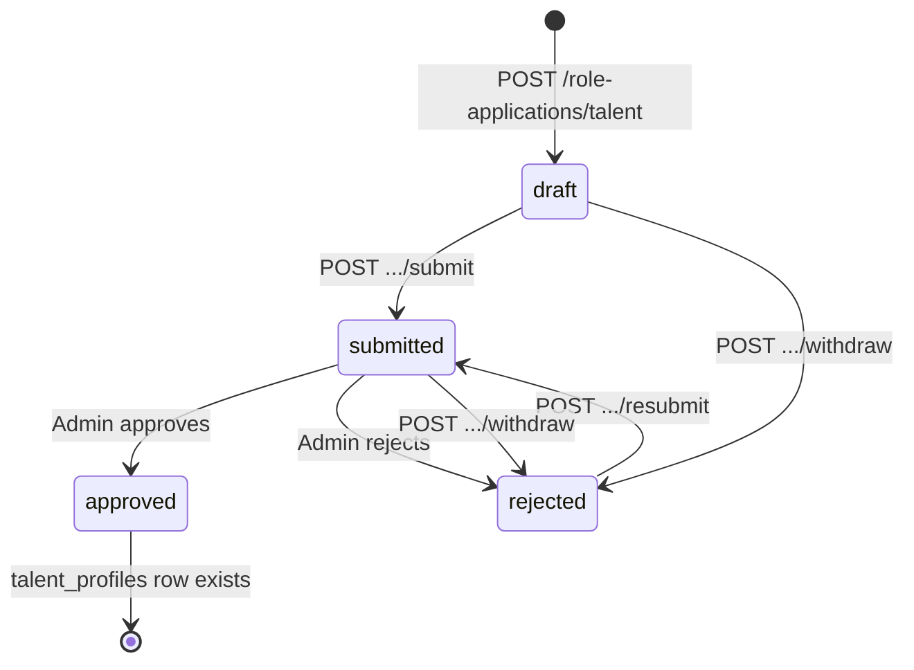

# Talent API — frontend implementation guide

**Date:** 2026-05-23  
**API base:** `https://<host>/api/v1/main`  
**Auth scope:** Sanctum token with ability `app:main` (`app.scope:main_website` middleware)  
**Related:** [`frontend-handoff-vendor-api.md`](frontend-handoff-vendor-api.md), [`API_REFERENCE.md`](API_REFERENCE.md), [`docs/sprints/PHASE-04-role-applications.md`](sprints/PHASE-04-role-applications.md), [`docs/sprints/PHASE-05-marketplace-profiles.md`](sprints/PHASE-05-marketplace-profiles.md)

---

## Summary

| Phase | Who | Key endpoints |
|-------|-----|----------------|
| **Browse** | Public | `GET /talents`, `GET /talents/{slug}`, `GET /talents/{slug}/ratings` |
| **Apply** | Logged-in guest | `POST /role-applications/talent`, `PATCH`, media, submit |
| **Live profile** | Approved talent | `GET/PATCH /me/talent-profile`, availability |
| **Hiring** | Talent (target) | `GET /me/engagements`, accept/decline/messages/complete |

After admin **approval**, a `talent_profiles` row is provisioned and the user role becomes `talent`. Until then, use **role application** endpoints only.

---

## Authentication

Protected routes require:

```http
Authorization: Bearer <sanctum_token>
```

Obtain via `POST /api/v1/main/auth/login` (main website app scope).

| HTTP | Meaning |
|------|---------|
| **401** | Missing/invalid token |
| **403** | Authenticated but not allowed (rare on talent routes) |
| **404** | Resource not found or not owned |
| **422** | Validation or business-rule failure |

---

## Standard error shapes

### Validation (`422`)

```json
{
  "message": "The given data was invalid.",
  "errors": {
    "stage_name": ["The stage name field is required."]
  }
}
```

### Business rule (`422`, single message)

```json
{
  "message": "Talent application payload is incomplete."
}
```

```json
{
  "message": "Invalid status transition from submitted to submitted."
}
```

```json
{
  "message": "Only rejected applications can be resubmitted."
}
```

```json
{
  "message": "Approved applications cannot be withdrawn."
}
```

```json
{
  "message": "Application type mismatch."
}
```

### Not found (`404`)

```json
{
  "message": "No query results for model [App\\Models\\TalentProfile] ..."
}
```

---

## Lifecycle diagram



**Status enum:** `not_started` | `draft` | `submitted` | `approved` | `rejected`  
(Withdrawn applications are stored as `rejected` with `rejection_reason: "Withdrawn by applicant"`.)

One talent application per user (`unique user_id + application_type`).

---

## 1. Public discovery (no auth)

### `GET /talents`

Paginated list of **active** talent profiles (`is_active = true`, not soft-deleted).

**Query parameters**

| Param | Type | Description |
|-------|------|-------------|
| `city_id` | integer | Filter by `city_id` |
| `slug` | string | Filter by exact slug |
| `page` | integer | Laravel pagination (default page size **20**) |

**Success `200`** — Laravel paginator (no `{ data }` wrapper):

```json
{
  "current_page": 1,
  "data": [
    {
      "id": 12,
      "user_id": 45,
      "application_id": 8,
      "slug": "dj-ahmed-12",
      "stage_name": "DJ Ahmed",
      "bio": "House & techno DJ",
      "region_id": 1,
      "city_id": 3,
      "profile_image_url": "https://cdn.example.com/headshot.jpg",
      "intro_video_url": null,
      "instagram_handle": "@djahmed",
      "website_url": "https://example.com",
      "travel_ready": true,
      "location_public": true,
      "availability_status": "available",
      "rating_average": "4.50",
      "rating_count": 12,
      "completed_bookings": 3,
      "is_active": true,
      "created_at": "2026-05-01T10:00:00.000000Z",
      "updated_at": "2026-05-10T12:00:00.000000Z",
      "deleted_at": null
    }
  ],
  "per_page": 20,
  "total": 1
}
```

**Failure:** none specific (empty `data` if no matches).

---

### `GET /talents/{slug}`

**Success `200`**

```json
{
  "data": {
    "id": 12,
    "slug": "dj-ahmed-12",
    "stage_name": "DJ Ahmed",
    "bio": "...",
    "profile_image_url": "...",
    "intro_video_url": null,
    "instagram_handle": "@djahmed",
    "website_url": "https://example.com",
    "travel_ready": true,
    "location_public": true,
    "availability_status": "available",
    "rating_average": "4.50",
    "rating_count": 12,
    "completed_bookings": 3,
    "categories": [
      {
        "id": 1,
        "talent_profile_id": 12,
        "talent_category_id": 4
      }
    ],
    "gallery": [
      {
        "id": 1,
        "talent_profile_id": 12,
        "image_url": "https://cdn.example.com/gig.jpg",
        "caption": "Festival set",
        "position": 0,
        "created_at": "2026-05-01T10:00:00.000000Z"
      }
    ]
  }
}
```

**Failure `404`** — unknown or inactive slug.

---

### `GET /talents/{slug}/ratings`

Public visible ratings for the profile.

**Success `200`** — paginator, `data[]` items:

```json
{
  "current_page": 1,
  "data": [
    {
      "id": 99,
      "user_id": 7,
      "target_type": "talent",
      "target_id": 12,
      "engagement_id": 5,
      "stars": 5,
      "comment": "Great performance",
      "is_visible": true,
      "created_at": "2026-05-15T08:00:00.000000Z",
      "updated_at": "2026-05-15T08:00:00.000000Z",
      "deleted_at": null
    }
  ],
  "per_page": 20,
  "total": 1
}
```

**Note:** Request body uses `review` when **creating** ratings; stored/returned field is **`comment`**.

---

## 2. Role application (onboarding)

Base path: **`/role-applications`** (auth required).

### `GET /role-applications/me`

All applications for the current user (talent, vendor, organizer).

**Success `200`**

```json
{
  "data": [
    {
      "id": 3,
      "user_id": 19,
      "application_type": "talent",
      "status": "draft",
      "submitted_at": null,
      "reviewed_at": null,
      "reviewed_by": null,
      "rejection_reason": null,
      "internal_note": null,
      "created_at": "2026-05-20T10:00:00.000000Z",
      "updated_at": "2026-05-20T10:00:00.000000Z",
      "talent_application": { "id": 2, "stage_name": "...", "contact_email": "..." },
      "vendor_application": null,
      "organizer_application": null
    }
  ]
}
```

---

### `GET /role-applications/talent/{id}`

Full talent application with nested media.

**Success `200`:** `{ "data": { ...role_application, "talent_application": { "media": [...] } } }`  
**Failure `404`:** not found or not owned. **`422`:** wrong `{role}` in URL.

---

### `POST /role-applications/talent`

Create or reopen draft (upsert per user + type).

**Body**

| Field | Type | Required | Rules |
|-------|------|----------|-------|
| `stage_name` | string | Yes | max 160 |
| `contact_email` | string | Yes | valid email |
| `contact_phone` | string | No | max 20 |

**Success `201`**

```json
{
  "data": {
    "id": 3,
    "user_id": 19,
    "application_type": "talent",
    "status": "draft",
    "talent_application": {
      "id": 2,
      "application_id": 3,
      "stage_name": "DJ Ahmed",
      "contact_email": "ahmed@example.com",
      "contact_phone": "+966500000000"
    }
  }
}
```

---

### `PATCH /role-applications/talent/{id}`

Update draft/rejected application fields. Send only fields you change.

**Talent-relevant body fields**

| Field | Maps to DB | Notes |
|-------|------------|-------|
| `stage_name` | `talent_applications.stage_name` | |
| `contact_email` | `contact_email` | |
| `contact_phone` | `contact_phone` | |
| `profile_image` | `profile_image_url` | URL string, max 500 |
| `bio` | `bio` | |
| `saudi_region_id` | `region_id` | integer |
| `city` | `city_id` | integer (Saudi city id) |
| `travel_ready` | `travel_ready` | boolean |
| `location_public` | `location_public` | boolean |
| `certificate_name` | `certificate_name` | |
| `accepted_quality_disclaimer` | `accepted_quality_disclaimer` | boolean |
| `internal_note` | `role_applications.internal_note` | applicant-only note |

**Success `200`:** `{ "data": { ...full application with nested talent_application.media } }`

---

### `POST /role-applications/talent/{id}/media`

**Body**

| Field | Type | Required | Rules |
|-------|------|----------|-------|
| `kind` | string | Yes | `url` \| `video` \| `image` \| `certificate` |
| `value` | string | Yes | URL or path, max 500 |
| `label` | string | No | max 255 |
| `position` | integer | No | min 0 |

**Success `201`**

```json
{
  "data": {
    "id": 10,
    "talent_application_id": 2,
    "kind": "image",
    "value": "https://cdn.example.com/photo.jpg",
    "label": "Live shot",
    "position": 0,
    "created_at": "2026-05-20T11:00:00.000000Z"
  }
}
```

---

### `DELETE /role-applications/talent/{id}/media/{mediaId}`

**Success `200`:** `{ "message": "Deleted" }`

---

### `POST /role-applications/talent/{id}/submit`

Validates required fields (`stage_name`, `contact_email`), moves to `submitted`.

**Success `200`:** `{ "data": { ...application, "status": "submitted", "submitted_at": "..." } }`

**Failure `422`**

- `"Talent application payload is incomplete."`
- `"Invalid status transition from submitted to submitted."` (already submitted)

---

### `POST /role-applications/talent/{id}/resubmit`

Only from **`rejected`**. Re-runs submit validation.

**Success `200`:** `{ "data": { "status": "submitted", ... } }`  
**Failure `422`:** `"Only rejected applications can be resubmitted."`

---

### `POST /role-applications/talent/{id}/withdraw`

**Success `200`:** `{ "data": { "status": "rejected", "rejection_reason": "Withdrawn by applicant", ... } }`  
**Failure `422`:** `"Approved applications cannot be withdrawn."`

---

## 3. Approved profile (post-approval)

Requires provisioned `talent_profiles` row (404 if user is not an approved talent).

### `GET /me/talent-profile`

**Success `200`**

```json
{
  "data": {
    "id": 12,
    "user_id": 19,
    "slug": "dj-ahmed-12",
    "stage_name": "DJ Ahmed",
    "bio": "...",
    "region_id": 1,
    "city_id": 3,
    "profile_image_url": "...",
    "intro_video_url": null,
    "instagram_handle": "@djahmed",
    "website_url": "https://example.com",
    "travel_ready": true,
    "location_public": true,
    "availability_status": "available",
    "rating_average": "4.50",
    "rating_count": 12,
    "completed_bookings": 3,
    "is_active": true,
    "created_at": "...",
    "updated_at": "..."
  }
}
```

**Failure `404`:** no profile for user.

---

### `PATCH /me/talent-profile`

At least one field required (Laravel `sometimes` rules).

| Field | Type | Rules |
|-------|------|-------|
| `stage_name` | string | max 160 |
| `bio` | string | nullable |
| `website_url` | string | nullable, valid URL, max 500 |
| `instagram_handle` | string | nullable, max 120 |
| `travel_ready` | boolean | |
| `location_public` | boolean | |

**Success `200`:** `{ "data": { ...updated profile } }`

**Note:** Profile image, categories, and gallery are copied from the application at approval time; there are **no** separate API endpoints to mutate profile gallery after approval in the current API.

---

### `GET /me/talent-availability`

**Success `200`**

```json
{
  "status": "available"
}
```

Enum: `available` | `reserved`

---

### `PUT /me/talent-availability`

**Body**

| Field | Type | Required | Values |
|-------|------|----------|--------|
| `status` | string | Yes | `available` \| `reserved` |

**Success `200`**

```json
{
  "status": "reserved"
}
```

---

## 4. Engagements (talent as hire target)

Organizers create engagements via `POST /me/engagements` with `target_type: "talent"`. Talents see inbound requests on **`GET /me/engagements`** (`target_user_id = current user`).

### `GET /me/engagements`

**Success `200`** — paginator (20/page):

```json
{
  "current_page": 1,
  "data": [
    {
      "id": 5,
      "organizer_user_id": 8,
      "target_type": "talent",
      "target_id": 12,
      "target_user_id": 19,
      "related_event_id": 18,
      "topic": "Opening set",
      "preview": "Need 60-min house set",
      "status": "pending",
      "organizer_profile_snapshot": { "display_name": "Event Co" },
      "target_profile_snapshot": { "stage_name": "DJ Ahmed" },
      "accepted_at": null,
      "declined_at": null,
      "declined_reason": null,
      "closed_at": null,
      "last_message_at": "2026-05-21T09:00:00.000000Z",
      "created_at": "2026-05-20T14:00:00.000000Z",
      "updated_at": "2026-05-21T09:00:00.000000Z"
    }
  ],
  "per_page": 20,
  "total": 1
}
```

**Status enum:** `pending` | `accepted` | `declined` | `cancelled` | `closed`

---

### `POST /me/engagements/{id}/accept`

Talent must be `target_user_id`.

**Success `200`:** `{ "data": { ...status: "accepted", "accepted_at": "..." } }`  
**Failure `422`:** invalid transition (e.g. already declined).

---

### `POST /me/engagements/{id}/decline`

**Body (optional):** `{ "reason": "Schedule conflict" }`

**Success `200`:** `{ "data": { ...status: "declined", "declined_reason": "..." } }`

---

### `POST /me/engagements/{id}/messages`

**Body**

| Field | Type | Required |
|-------|------|----------|
| `body` | string | Yes |
| `attachment_url` | string | No, max 500 |

**Success `201`**

```json
{
  "data": {
    "id": 44,
    "engagement_id": 5,
    "sender_user_id": 19,
    "sender": "talent",
    "body": "I can do 90 minutes",
    "attachment_url": null,
    "read_at": null,
    "created_at": "2026-05-21T10:00:00.000000Z"
  }
}
```

---

### `POST /me/engagements/{id}/complete`

Marks engagement **`closed`** (either organizer or talent on this row).

**Success `200`:** `{ "data": { ...status: "closed", "closed_at": "..." } }`

---

## 5. Ratings (related)

Talents **receive** ratings; organizers **create** them after a **closed** engagement.

### Create rating (organizer only) — `POST /ratings`

Not callable by talent for self-rating. Documented for context when building talent profile UI (display only).

**Body:** `target_type: "talent"`, `target_id: <talent_profile.id>`, `stars` 1–5, optional `review`, optional `engagement_id`.

Eligibility: organizer must have a **closed** engagement with that talent profile.

---

## TypeScript reference

```ts
export type RoleApplicationStatus =
  | 'not_started'
  | 'draft'
  | 'submitted'
  | 'approved'
  | 'rejected';

export type TalentAvailability = 'available' | 'reserved';

export type EngagementStatus =
  | 'pending'
  | 'accepted'
  | 'declined'
  | 'cancelled'
  | 'closed';

export interface TalentProfile {
  id: number;
  user_id: number;
  slug: string;
  stage_name: string;
  bio: string | null;
  region_id: number | null;
  city_id: number | null;
  profile_image_url: string | null;
  intro_video_url: string | null;
  instagram_handle: string | null;
  website_url: string | null;
  travel_ready: boolean;
  location_public: boolean;
  availability_status: TalentAvailability;
  rating_average: string;
  rating_count: number;
  completed_bookings: number;
  is_active: boolean;
  categories?: TalentProfileCategory[];
  gallery?: TalentProfileGalleryItem[];
}

export interface TalentApplicationMedia {
  id: number;
  kind: 'url' | 'video' | 'image' | 'certificate';
  value: string;
  label: string | null;
  position: number;
}

export interface LaravelPaginator<T> {
  current_page: number;
  data: T[];
  per_page: number;
  total: number;
  last_page: number;
  next_page_url: string | null;
  prev_page_url: string | null;
}
```

---

## Frontend checklist

- [ ] Onboarding wizard → `POST /role-applications/talent` then `PATCH` + media uploads
- [ ] Submit only when `stage_name` + `contact_email` filled
- [ ] Poll `GET /role-applications/me` or `GET /role-applications/talent/{id}` for `status`
- [ ] After `approved`, switch to `GET /me/talent-profile` (404 → still provisioning)
- [ ] Public card links use **`slug`**, not numeric id
- [ ] Availability toggle → `PUT /me/talent-availability`
- [ ] Engagements inbox → `GET /me/engagements` + accept/decline/message actions
- [ ] Media URLs: API expects **already-uploaded** URLs (no multipart upload endpoint in this API)

---

## Out of scope (this guide)

- Admin review/approve (`/api/v1/admin/...`)
- Organizer attaching talent to events (`/api/v1/organizer/events/{id}/talents`)
- File upload service (use your CDN/storage pipeline, pass URLs in JSON)
