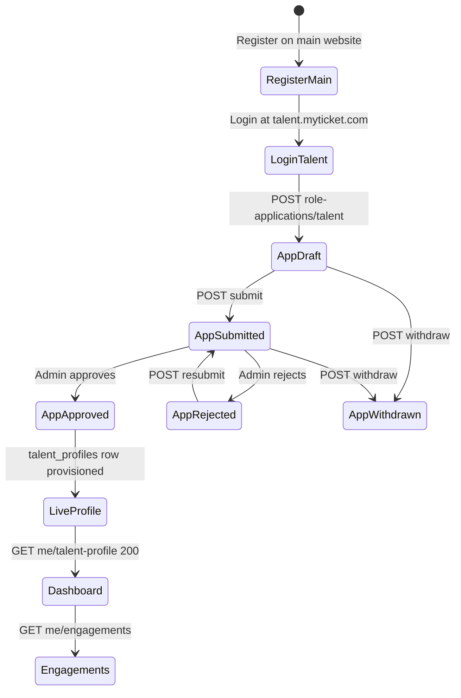
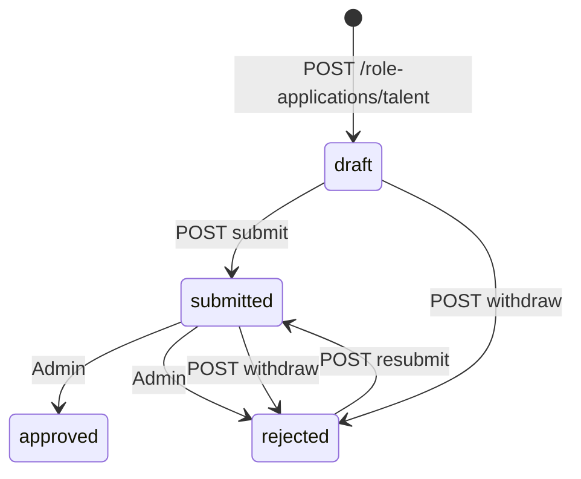

# MyTicket — Talent Dashboard Build Guide

> **Type:** Talent Dashboard (Standalone micro-frontend)  
> **URL:** `talent.myticket.com` (dev: `http://localhost:5175`)  
> **Users:** Guest applicants → approved Talent  
> **Stack:** Bun · Vite 8 · React 19 · TypeScript · Tailwind CSS 4 · Lucide React · shadcn/ui · Redux Toolkit · RTK Query · react-hook-form · Yup · react-i18next  
> **Master references:** [`myticket_platform_flow.md`](myticket_platform_flow.md) · [`myticket_shared_flow.md`](../myticket_shared_flow.md) · [`CLAUDE_DESIGN_SYSTEM.md`](CLAUDE_DESIGN_SYSTEM.md) · [`frontend-handoff-talent-api.md`](frontend-handoff-talent-api.md)  
> **Migration sources:** [`main/`](../main/) (`TalentSteps`, `EngagementsPage`, `baseApi`, schemas) · [`organizer/`](../organizer/) (shell layout, nav pattern)  
> **Last Updated:** June 2026

---

## Table of Contents

1. [Overview and Architecture](#1-overview-and-architecture)
2. [Project Bootstrap (Bun + Vite)](#2-project-bootstrap-bun--vite)
3. [Design System Implementation](#3-design-system-implementation)
4. [Authentication and Authorization](#4-authentication-and-authorization)
5. [API Layer (RTK Query)](#5-api-layer-rtk-query)
6. [Yup Schemas](#6-yup-schemas)
7. [Application Wizard (Pre-Approval)](#7-application-wizard-pre-approval)
8. [Post-Approval Dashboard Pages](#8-post-approval-dashboard-pages)
9. [Internationalization (AR/EN + RTL)](#9-internationalization-aren--rtl)
10. [State Management Layout](#10-state-management-layout)
11. [Cross-App Integration](#11-cross-app-integration)
12. [Testing and Quality Checklist](#12-testing-and-quality-checklist)
13. [Implementation Phases](#13-implementation-phases)
14. [Appendix](#14-appendix)

---

## 1. Overview and Architecture

### 1.1 Product role

The **Talent Dashboard** is the fifth MyTicket micro-frontend. It gives artists and performers a dedicated workspace to:

- Apply for the Talent role (onboarding wizard)
- Track application review status
- Manage their live marketplace profile (post-approval)
- Toggle availability (`available` / `reserved`)
- Respond to organizer hiring requests (engagements inbox + messaging)

It does **not** replace the main website for event discovery, ticket purchase, or organizer-initiated marketplace browsing.

### 1.2 Platform split

| Concern | Owner app | Notes |
|---|---|---|
| User registration | **Main website** (`myticket.com`) | Only app where new accounts are created ([`myticket_shared_flow.md` §3.1](../myticket_shared_flow.md)) |
| Talent role application wizard | **Talent dashboard** | `POST /role-applications/talent` and lifecycle |
| Post-approval profile + availability | **Talent dashboard** | `GET/PATCH /me/talent-profile`, `PUT /me/talent-availability` |
| Engagements inbox (talent side) | **Talent dashboard** | `GET /me/engagements`, accept/decline/message/complete |
| Public talent profile page | **Main website** | `GET /talents/{slug}` — marketplace discovery |
| Organizer initiates hiring | **Main website / Organizer dashboard** | `POST /me/engagements` (organizer only) |
| My Tickets, booking, auction | **Main website** | Link out via `VITE_MAIN_WEBSITE_URL` |
| Admin approval | **Admin dashboard** | Out of scope for this guide |

### 1.3 User lifecycle



**Application status enum** (from API): `not_started` | `draft` | `submitted` | `approved` | `rejected`  
(Withdrawn applications are stored as `rejected` with `rejection_reason: "Withdrawn by applicant"`.)

### 1.4 Access matrix

| `user.role` | Application `status` | `GET /me/talent-profile` | Allowed routes |
|---|---|---|---|
| `guest` | none | — | `/application` (start wizard), `/login` |
| `guest` | `draft` / `rejected` | 404 | `/application`, `/application/status` |
| `guest` | `submitted` | 404 | `/application/status` (read-only) |
| `talent` | `approved` | 200 | Full dashboard (`/`, `/profile`, `/engagements`, …) |
| `organizer` / `vendor` | any | — | `/access-denied` |
| any | — | — | `/login`, `/forgot-password`, `/reset-password` |

### 1.5 Post-login routing logic

Implement in `src/lib/resolvePostLoginRoute.ts`:

```ts
export function resolvePostLoginRoute(input: {
  role: string | null;
  hasTalentApplication: boolean;
  applicationStatus: RoleApplicationStatus | null;
  hasTalentProfile: boolean;
}): string {
  const { role, hasTalentApplication, applicationStatus, hasTalentProfile } = input;

  if (role === 'organizer' || role === 'vendor') return '/access-denied';
  if (hasTalentProfile || role === 'talent') return '/';
  if (!hasTalentApplication) return '/application';
  if (applicationStatus === 'submitted') return '/application/status';
  if (applicationStatus === 'draft' || applicationStatus === 'rejected') return '/application';
  if (applicationStatus === 'approved') return '/'; // profile may still be provisioning
  return '/application';
}
```

Poll `GET /me/talent-profile` after `approved` — 404 means provisioning is not finished; show a holding screen on `/application/status`.

### 1.6 Key business rules (Talent-specific)

From [`myticket_platform_flow.md`](myticket_platform_flow.md) §15 and §29:

- Role selection is **final** — once approved as Talent, no role switching.
- Marketplace financial arrangements happen **outside** the platform.
- Availability auto-changes to `reserved` when a talent **accepts** an engagement; talent can manually switch back to `available`.
- Ratings are **stars only** on the product surface (no written reviews displayed to users).
- Platform currency is **SAR**; UI is **bilingual AR/EN** with full RTL/LTR.
- Media URLs sent to the API must be **already-uploaded** public URLs (no multipart on role-application endpoints).

---

## 2. Project Bootstrap (Bun + Vite)

### 2.1 Prerequisites

- [Bun](https://bun.sh) ≥ 1.1
- Node.js 20+ (for tooling compatibility)
- Running MyTicket API at `http://localhost:8000` (or your staging host)

### 2.2 Scaffold commands

From the monorepo root (`my-ticket-website/`):

```bash
cd talent
bun create vite . --template react-ts
bun add react@^19 react-dom@^19 react-router-dom@^7 \
  @reduxjs/toolkit react-redux \
  react-hook-form @hookform/resolvers yup \
  i18next react-i18next i18next-browser-languagedetector \
  lucide-react clsx tailwind-merge class-variance-authority \
  @fontsource/plus-jakarta-sans @fontsource/space-grotesk \
  @emran-alhaddad/saudi-riyal-font sonner
bun add -d tailwindcss @tailwindcss/vite tw-animate-css shadcn typescript vite @vitejs/plugin-react \
  eslint typescript-eslint vitest @testing-library/react jsdom
bunx shadcn@latest init
bunx shadcn@latest add button card badge dialog sheet tabs input textarea select sonner
```

### 2.3 Recommended `package.json` scripts

```json
{
  "name": "myticket-talent",
  "private": true,
  "type": "module",
  "scripts": {
    "dev": "vite --port 5175",
    "build": "tsc -b && vite build",
    "lint": "eslint .",
    "preview": "vite preview --port 5175",
    "test": "vitest run"
  }
}
```

### 2.4 Folder tree

```
talent/
├── public/
├── src/
│   ├── api/
│   │   ├── authToken.ts
│   │   ├── baseApi.ts
│   │   ├── types/
│   │   │   ├── auth.ts
│   │   │   ├── common.ts
│   │   │   ├── engagement.ts
│   │   │   ├── roleApplication.ts
│   │   │   ├── talent.ts
│   │   │   └── user.ts
│   │   └── endpoints/
│   │       ├── auth.ts
│   │       ├── engagements.ts
│   │       ├── index.ts
│   │       ├── me.ts
│   │       ├── roleApplications.ts
│   │       ├── saudiRegions.ts
│   │       └── talents.ts
│   ├── components/
│   │   ├── auth/
│   │   │   ├── RequireAuth.tsx
│   │   │   ├── RequireApprovedTalent.tsx
│   │   │   └── RequireTalentCandidate.tsx
│   │   ├── forms/
│   │   │   ├── Field.tsx
│   │   │   ├── CharCounter.tsx
│   │   │   └── SaudiPhoneInput.tsx
│   │   ├── layout/
│   │   │   ├── TalentShell.tsx
│   │   │   ├── Sidebar.tsx
│   │   │   └── TopBar.tsx
│   │   ├── talent/
│   │   │   ├── ApplicationStatusBanner.tsx
│   │   │   ├── AvailabilityToggle.tsx
│   │   │   ├── EngagementThread.tsx
│   │   │   ├── MediaGalleryManager.tsx
│   │   │   ├── PublicProfilePreviewCard.tsx
│   │   │   └── StatBubble.tsx
│   │   └── ui/                    # shadcn primitives
│   ├── config/
│   │   ├── env.ts
│   │   └── nav.ts
│   ├── contexts/
│   │   └── AuthContext.tsx
│   ├── hooks/
│   │   ├── useAppDispatch.ts
│   │   └── useAppSelector.ts
│   ├── i18n/
│   │   ├── index.ts
│   │   └── locales/
│   │       ├── en.json
│   │       └── ar.json
│   ├── layouts/
│   │   ├── ApplicationLayout.tsx
│   │   ├── PublicAuthLayout.tsx
│   │   └── TalentShellLayout.tsx
│   ├── lib/
│   │   ├── apiErrors.ts
│   │   ├── engagementMappers.ts
│   │   ├── resolvePostLoginRoute.ts
│   │   ├── roleApplicationMappers.ts
│   │   ├── saudiLocations.ts
│   │   ├── upload.ts
│   │   └── utils.ts
│   ├── pages/
│   │   ├── application/
│   │   │   ├── ApplicationStatusPage.tsx
│   │   │   └── ApplicationWizardPage.tsx
│   │   ├── auth/
│   │   │   ├── AccessDeniedPage.tsx
│   │   │   ├── ForgotPasswordPage.tsx
│   │   │   ├── LoginPage.tsx
│   │   │   └── ResetPasswordPage.tsx
│   │   ├── dashboard/
│   │   │   └── HomePage.tsx
│   │   ├── engagements/
│   │   │   ├── EngagementDetailPage.tsx
│   │   │   └── EngagementsPage.tsx
│   │   ├── profile/
│   │   │   ├── AvailabilityPage.tsx
│   │   │   ├── ProfilePage.tsx
│   │   │   └── PublicProfilePreviewPage.tsx
│   │   └── ratings/
│   │       └── RatingsPage.tsx
│   ├── schemas/
│   │   ├── application.ts
│   │   ├── auth.ts
│   │   ├── engagement.ts
│   │   ├── index.ts
│   │   └── profile.ts
│   ├── store/
│   │   ├── hooks.ts
│   │   └── index.ts
│   ├── types/
│   │   └── domain.ts
│   ├── App.tsx
│   ├── main.tsx
│   └── index.css
├── .env.example
├── index.html
├── tsconfig.json
├── tsconfig.app.json
├── vite.config.ts
└── eslint.config.js
```

### 2.5 Environment variables

Create `.env.example`:

```env
# API
VITE_API_BASE_URL=http://localhost:8000
VITE_API_PREFIX=/api/v1/main

# Cross-app links
VITE_MAIN_WEBSITE_URL=http://localhost:5173
VITE_TALENT_DASHBOARD_URL=http://localhost:5175

# Optional CDN upload (your storage pipeline)
VITE_UPLOAD_URL=
VITE_UPLOAD_API_KEY=

# Dev server
VITE_DEV_PORT=5175
```

`src/config/env.ts`:

```ts
export const ENV = {
  apiBase: import.meta.env.VITE_API_BASE_URL ?? 'http://localhost:8000',
  apiPrefix: import.meta.env.VITE_API_PREFIX ?? '/api/v1/main',
  mainWebsiteUrl: import.meta.env.VITE_MAIN_WEBSITE_URL ?? 'http://localhost:5173',
  uploadUrl: import.meta.env.VITE_UPLOAD_URL ?? '',
} as const;
```

### 2.6 Vite config

`vite.config.ts` — mirror organizer/main:

```ts
import path from 'node:path';
import tailwindcss from '@tailwindcss/vite';
import react from '@vitejs/plugin-react';
import { defineConfig, loadEnv } from 'vite';

export default defineConfig(({ mode }) => {
  const env = loadEnv(mode, process.cwd(), '');
  const port = Number(env.VITE_DEV_PORT ?? 5175);

  return {
    plugins: [react(), tailwindcss()],
    resolve: {
      alias: { '@': path.resolve(__dirname, './src') },
    },
    server: { port, strictPort: true },
    preview: { port },
  };
});
```

### 2.7 TypeScript path alias

`tsconfig.app.json`:

```json
{
  "compilerOptions": {
    "baseUrl": ".",
    "paths": { "@/*": ["./src/*"] }
  }
}
```

### 2.8 Entry wiring

`src/main.tsx`:

```tsx
import '@fontsource/plus-jakarta-sans/400.css';
import '@fontsource/plus-jakarta-sans/500.css';
import '@fontsource/plus-jakarta-sans/600.css';
import '@fontsource/plus-jakarta-sans/700.css';
import '@fontsource/plus-jakarta-sans/800.css';
import '@fontsource/space-grotesk/400.css';
import '@fontsource/space-grotesk/700.css';
import '@emran-alhaddad/saudi-riyal-font/index.css';
import './i18n';
import './index.css';
import { StrictMode } from 'react';
import { createRoot } from 'react-dom/client';
import { Provider } from 'react-redux';
import { store } from '@/store';
import { App } from '@/App';

createRoot(document.getElementById('root')!).render(
  <StrictMode>
    <Provider store={store}>
      <App />
    </Provider>
  </StrictMode>,
);
```

---

## 3. Design System Implementation

Follow [`CLAUDE_DESIGN_SYSTEM.md`](CLAUDE_DESIGN_SYSTEM.md). Icons are **Lucide React** (not Phosphor — per design system v2.0).

### 3.1 Tailwind 4 theme (`src/index.css`)

Port the organizer token block:

```css
@import "tailwindcss";
@import "tw-animate-css";
@import "shadcn/tailwind.css";

@theme {
  --font-sans: "Plus Jakarta Sans", system-ui, sans-serif;
  --font-mono: "Space Grotesk", system-ui, sans-serif;

  --color-coral: #ff6b4a;
  --color-coral-light: #ffb8a8;
  --color-coral-dark: #cc4a2e;
  --color-lemon: #f5e642;
  --color-lemon-light: #fdf4a0;
  --color-lemon-dark: #c9bc1a;
  --color-lime: #baff39;
  --color-sky: #a8c9f0;
  --color-mint: #4dffc3;
  --color-amber: #f4a05a;
  --color-indigo: #3355ff;
  --color-lavender: #c4b5f4;
  --color-teal: #6ecfb0;
  --color-blush: #f9b8c4;

  --color-ink: #0d0d0d;
  --color-ink-90: #1a1a1a;
  --color-ink-80: #2e2e2e;
  --color-ink-60: #555555;
  --color-ink-40: #888888;
  --color-ink-20: #bbbbbb;
  --color-ink-10: #e5e5e5;
  --color-ink-5: #f5f5f5;

  --color-surface-page: #ffffff;
  --color-surface-tint: #f5f5f5;
  --color-surface-warm: #f0ede6;
  --color-surface-dark: #0d0d0d;
}

@layer base {
  *, *::before, *::after { box-sizing: border-box; }
  body {
    margin: 0;
    min-height: 100dvh;
    background: var(--color-surface-page);
    color: var(--color-ink);
    font-family: var(--font-sans);
    -webkit-font-smoothing: antialiased;
  }
  .scrollbar-hide::-webkit-scrollbar { display: none; }
  .scrollbar-hide { -ms-overflow-style: none; scrollbar-width: none; }
}
```

### 3.2 Utility helper

`src/lib/utils.ts`:

```ts
import { clsx, type ClassValue } from 'clsx';
import { twMerge } from 'tailwind-merge';

export function cn(...inputs: ClassValue[]) {
  return twMerge(clsx(inputs));
}
```

### 3.3 Dashboard shell (`TalentShell`)

Mirror [`organizer/src/layouts/OrganizerShell.tsx`](../organizer/src/layouts/OrganizerShell.tsx):

- Sticky top bar: logo tile (lemon + `Ticket` Lucide icon), language toggle, user menu
- Left sidebar from `NAV_MAIN` (see [§14.3](#143-nav-config))
- Content area: `max-w-[1280px] mx-auto px-6 py-8`
- Mobile: collapsible sidebar via shadcn `Sheet`

### 3.4 Dashboard-specific components

| Component | Purpose | Design notes |
|---|---|---|
| `StatBubble` | Home KPI tiles | `rounded-[28px]`, `font-mono` for numbers ([design system §7](CLAUDE_DESIGN_SYSTEM.md)) |
| `ApplicationStatusBanner` | Wizard / status pages | Color by status: `draft` ink-5, `submitted` sky, `rejected` coral, `approved` mint |
| `AvailabilityToggle` | Available / Reserved pill | Lemon = available, lavender = reserved |
| `EngagementThread` | Inbox detail pane | Split layout; message bubbles; `dir` aware |
| `MediaGalleryManager` | Application step 3 | Grid of tiles; kind badges (`image`, `video`, `certificate`, `url`) |
| `PublicProfilePreviewCard` | `/preview` | Read-only card linking to main site `/artists/{slug}` |

### 3.5 Status pill colors

```ts
export const APPLICATION_STATUS_PILL: Record<string, string> = {
  draft: 'bg-ink-5 text-ink-60',
  submitted: 'bg-sky/30 text-ink-DEFAULT',
  approved: 'bg-mint/30 text-mint-dark',
  rejected: 'bg-coral/15 text-coral',
};

export const ENGAGEMENT_STATUS_PILL: Record<string, string> = {
  pending: 'bg-ink-5 text-ink-60',
  accepted: 'bg-mint/30 text-mint-dark',
  declined: 'bg-coral/15 text-coral',
  cancelled: 'bg-ink-5 text-ink-40',
  closed: 'bg-lavender/30 text-ink-DEFAULT',
};
```

---

## 4. Authentication and Authorization

Follow [`myticket_shared_flow.md` §3.6–3.7](../myticket_shared_flow.md).

### 4.1 Login page (`/login`)

- Email + password form with `loginSchema` + `react-hook-form`
- **Sign in with Google** button (same OAuth redirect/callback contract as main)
- Link to `/forgot-password`
- On success: `persistAuthCookies()` then `GET /me` + `GET /role-applications/me` → `resolvePostLoginRoute()`

### 4.2 Token persistence

Port [`main/src/api/authToken.ts`](../main/src/api/authToken.ts) — **first-party cookies**, not raw `localStorage`:

| Cookie | Purpose |
|---|---|
| `myticket_at` | Sanctum access token |
| `myticket_rt` | Refresh token |
| `myticket_meta` | JSON snapshot (`expires_at`, minimal `user`) |

`baseApi.prepareHeaders` reads `getToken()` and sets `Authorization: Bearer <token>`.

### 4.3 Route guards

```tsx
// RequireAuth — any valid session
export function RequireAuth({ children }: { children: React.ReactNode }) {
  const token = getToken();
  if (!token) return <Navigate to="/login" state={{ from: location }} replace />;
  return children;
}

// RequireTalentCandidate — guest with application OR approved talent
export function RequireTalentCandidate({ children }: { children: React.ReactNode }) {
  const { user, talentApplication } = useAuth();
  if (user?.role === 'organizer' || user?.role === 'vendor') {
    return <Navigate to="/access-denied" replace />;
  }
  if (user?.role === 'talent' || talentApplication) return children;
  return <Navigate to="/application" replace />;
}

// RequireApprovedTalent — GET /me/talent-profile must succeed
export function RequireApprovedTalent({ children }: { children: React.ReactNode }) {
  const { data: profile, isLoading, isError } = useGetTalentProfileQuery();
  if (isLoading) return <PageSkeleton />;
  if (isError || !profile) return <Navigate to="/application" replace />;
  return children;
}
```

### 4.4 `AuthContext`

Thin wrapper over RTK Query:

```ts
interface AuthContextValue {
  user: UserMe | null;
  talentApplication: RoleApplicationSummary | null;
  isLoading: boolean;
  signIn: (email: string, password: string) => Promise<void>;
  signInGoogle: () => void;
  signOut: () => void;
}
```

- `useGetMeQuery()` for live user
- `useGetMyRoleApplicationsQuery()` → pick `talent` slot
- `signOut` calls `clearTokens()` + `baseApi.util.resetApiState()`

### 4.5 Password reset

- `/forgot-password` — email form → `POST /auth/forgot-password`
- `/reset-password?token=...` — new password form → `POST /auth/reset-password`
- UI copy and validation shared with main website patterns

### 4.6 Access denied (`/access-denied`)

Shown when `role === 'organizer' | 'vendor'`. Provide link back to `VITE_MAIN_WEBSITE_URL`.

---

## 5. API Layer (RTK Query)

**Base URL:** `https://<host>/api/v1/main`  
**Auth:** `Authorization: Bearer <sanctum_token>` with ability `app:main`

### 5.1 `baseApi.ts`

```ts
import { createApi, fetchBaseQuery } from '@reduxjs/toolkit/query/react';
import { getToken } from '@/api/authToken';
import { ENV } from '@/config/env';

function joinUrl(base: string, prefix: string): string {
  const left = base.endsWith('/') ? base.slice(0, -1) : base;
  const right = prefix.startsWith('/') ? prefix : `/${prefix}`;
  return `${left}${right}`;
}

export const API_BASE_URL = joinUrl(ENV.apiBase, ENV.apiPrefix);

export const apiTagTypes = [
  'Me',
  'Session',
  'RoleApplication',
  'TalentProfile',
  'TalentAvailability',
  'Engagement',
  'Rating',
  'SaudiRegion',
  'Preferences',
] as const;

export const baseApi = createApi({
  reducerPath: 'api',
  baseQuery: fetchBaseQuery({
    baseUrl: API_BASE_URL,
    prepareHeaders: (headers) => {
      const token = getToken();
      if (token) headers.set('Authorization', `Bearer ${token}`);
      headers.set('Accept', 'application/json');
      return headers;
    },
  }),
  tagTypes: apiTagTypes,
  endpoints: () => ({}),
});
```

### 5.2 Endpoint modules

| Module | Hooks | Endpoints |
|---|---|---|
| `authApi` | `useLoginMutation`, `useLogoutMutation` | `POST /auth/login`, `POST /auth/logout` |
| `meApi` | `useGetMeQuery`, `useUpdateMeMutation`, `useGetPreferencesQuery`, `useUpdatePreferencesMutation`, `useGetTalentProfileQuery`, `useUpdateTalentProfileMutation`, `useGetTalentAvailabilityQuery`, `useSetTalentAvailabilityMutation` | `/me`, `/me/preferences`, `/me/talent-profile`, `/me/talent-availability` |
| `roleApplicationsApi` | `useGetMyRoleApplicationsQuery`, `useGetRoleApplicationQuery`, `useCreateTalentApplicationMutation`, `useUpdateTalentApplicationMutation`, `useSubmitTalentApplicationMutation`, `useResubmitTalentApplicationMutation`, `useWithdrawTalentApplicationMutation`, `useAddTalentMediaMutation`, `useDeleteTalentMediaMutation` | `/role-applications/*` |
| `engagementsApi` | `useListEngagementsQuery`, `useAcceptEngagementMutation`, `useDeclineEngagementMutation`, `usePostEngagementMessageMutation`, `useCompleteEngagementMutation` | `/me/engagements/*` |
| `talentsPublicApi` | `useGetTalentBySlugQuery`, `useListTalentRatingsQuery` | `GET /talents/{slug}`, `GET /talents/{slug}/ratings` |
| `saudiRegionsApi` | `useGetSaudiRegionsQuery` | Regions/cities lookup (same as main) |

Port implementations from:

- [`main/src/api/endpoints/roleApplications.ts`](../main/src/api/endpoints/roleApplications.ts)
- [`main/src/api/endpoints/me.ts`](../main/src/api/endpoints/me.ts)
- [`main/src/api/endpoints/engagements.ts`](../main/src/api/endpoints/engagements.ts)

**Talent dashboard subset:** omit vendor/organizer application mutations and `createEngagement` (organizer-only).

### 5.3 Cache invalidation rules

| Mutation | Invalidates |
|---|---|
| `updateTalentApplication` | `RoleApplication` |
| `submitTalentApplication` | `RoleApplication`, `Me` |
| `addTalentMedia` / `deleteTalentMedia` | `RoleApplication` |
| `updateTalentProfile` | `TalentProfile`, `Me` |
| `setTalentAvailability` | `TalentAvailability` |
| `acceptEngagement` | `Engagement`, `TalentAvailability` (refetch availability after accept) |
| `declineEngagement` | `Engagement` |
| `postEngagementMessage` | `Engagement:{id}` |
| `completeEngagement` | `Engagement` |

### 5.4 Response envelope handling

Laravel returns mixed shapes. Normalize in `transformResponse`:

```ts
// Single resource — may be bare or { data: T }
function unwrapData<T>(raw: T | { data: T }): T {
  if (raw && typeof raw === 'object' && 'data' in (raw as object)) {
    return (raw as { data: T }).data;
  }
  return raw as T;
}

// Paginator — always top-level, no extra wrapper
export interface LaravelPaginator<T> {
  current_page: number;
  data: T[];
  per_page: number;
  total: number;
  last_page: number;
  next_page_url: string | null;
  prev_page_url: string | null;
}
```

### 5.5 Error normalization

`src/lib/apiErrors.ts`:

```ts
export function readApiErrorMessage(err: unknown, fallback: string): string {
  if (err && typeof err === 'object') {
    const data = (err as { data?: unknown }).data;
    if (data && typeof data === 'object') {
      const message = (data as { message?: unknown }).message;
      if (typeof message === 'string' && message.trim()) return message;
      const errors = (data as { errors?: Record<string, string[]> }).errors;
      if (errors) {
        const first = Object.values(errors).flat()[0];
        if (first) return first;
      }
    }
  }
  return fallback;
}
```

| HTTP | Meaning | UI action |
|---|---|---|
| **401** | Missing/invalid token | Clear cookies → `/login` |
| **403** | Not allowed | Toast + stay on page |
| **404** | Not found / not owned | Empty state or redirect |
| **422** | Validation / business rule | Inline field errors or banner |

### 5.6 Full API quick reference

See [§14.2](#142-api-quick-reference) for the complete endpoint table sourced from [`frontend-handoff-talent-api.md`](frontend-handoff-talent-api.md).

---

## 6. Yup Schemas

Use **react-hook-form** + **`@hookform/resolvers/yup`**. Mirror [`main/src/schemas/`](../main/src/schemas/).

### 6.1 Constants

From [`main/src/lib/onboardingValidation.ts`](../main/src/lib/onboardingValidation.ts):

```ts
export const TALENT_BIO_MIN_CHARS = 30;
export const TALENT_BIO_MAX_CHARS = 500;
export const STAGE_NAME_MAX = 160;
export const CONTACT_PHONE_MAX = 20;
export const MEDIA_URL_MAX = 500;
```

### 6.2 Schema catalog

#### `loginSchema` — `src/schemas/auth.ts`

```ts
import * as yup from 'yup';

export const loginSchema = yup.object({
  email: yup.string().trim().email('Enter a valid email.').required('Email is required.'),
  password: yup.string().required('Password is required.'),
}).strict();

export type LoginSchema = yup.InferType<typeof loginSchema>;
```

#### `createTalentApplicationSchema` — wizard step 1

```ts
export const createTalentApplicationSchema = yup.object({
  stage_name: yup
    .string()
    .trim()
    .min(2, 'Stage name is required.')
    .max(STAGE_NAME_MAX, `Maximum ${STAGE_NAME_MAX} characters.`)
    .required('Stage name is required.'),
  contact_email: yup
    .string()
    .trim()
    .email('Enter a valid email.')
    .required('Contact email is required.'),
  contact_phone: yup
    .string()
    .trim()
    .max(CONTACT_PHONE_MAX)
    .matches(/^\+?[0-9 ()-]{0,20}$/, 'Enter a valid phone number.')
    .notRequired(),
}).strict();
```

#### `talentApplicationPatchSchema` — wizard steps 2–3

```ts
export const talentApplicationPatchSchema = yup.object({
  stage_name: yup.string().trim().max(STAGE_NAME_MAX).notRequired(),
  contact_email: yup.string().trim().email().notRequired(),
  contact_phone: yup.string().trim().max(CONTACT_PHONE_MAX).notRequired(),
  profile_image: yup
    .string()
    .trim()
    .max(MEDIA_URL_MAX)
    .test('url', 'Must be a valid https URL.', (v) => !v || /^https?:\/\/.+/i.test(v))
    .notRequired(),
  bio: yup
    .string()
    .trim()
    .min(TALENT_BIO_MIN_CHARS, `Bio must be at least ${TALENT_BIO_MIN_CHARS} characters.`)
    .max(TALENT_BIO_MAX_CHARS)
    .notRequired(),
  saudi_region_id: yup.number().integer().positive().notRequired(),
  city: yup.number().integer().positive().notRequired(), // Saudi city id
  travel_ready: yup.boolean().notRequired(),
  location_public: yup.boolean().notRequired(),
  certificate_name: yup.string().trim().max(255).notRequired(),
  accepted_quality_disclaimer: yup.boolean().oneOf([true], 'You must accept the quality disclaimer.').notRequired(),
}).strict();
```

#### `talentMediaSchema` — add media item

```ts
export const talentMediaSchema = yup.object({
  kind: yup
    .string()
    .oneOf(['url', 'video', 'image', 'certificate'])
    .required('Media kind is required.'),
  value: yup
    .string()
    .trim()
    .max(MEDIA_URL_MAX)
    .url('Must be a valid URL.')
    .required('URL is required.'),
  label: yup.string().trim().max(255).notRequired(),
  position: yup.number().integer().min(0).notRequired(),
}).strict();
```

#### `updateTalentProfileSchema` — post-approval `/profile`

```ts
export const updateTalentProfileSchema = yup.object({
  stage_name: yup.string().trim().max(STAGE_NAME_MAX).notRequired(),
  bio: yup.string().trim().max(2000).nullable().notRequired(),
  website_url: yup.string().trim().url().max(500).nullable().notRequired(),
  instagram_handle: yup.string().trim().max(120).nullable().notRequired(),
  travel_ready: yup.boolean().notRequired(),
  location_public: yup.boolean().notRequired(),
}).strict();
```

#### `talentAvailabilitySchema`

```ts
export const talentAvailabilitySchema = yup.object({
  status: yup
    .string()
    .oneOf(['available', 'reserved'], 'Status must be available or reserved.')
    .required('Status is required.'),
}).strict();
```

#### `engagementMessageSchema`

Port from [`main/src/schemas/engagement.ts`](../main/src/schemas/engagement.ts).

#### `declineEngagementSchema`

```ts
export const declineEngagementSchema = yup.object({
  reason: yup.string().trim().max(500, 'Reason is too long.').notRequired(),
}).strict();
```

### 6.3 Submit gate validation

Before `POST .../submit`, client-side gate (mirrors API):

```ts
export function isTalentApplicationReady(app: TalentApplicationDetail): boolean {
  const t = app.talent_application;
  if (!t) return false;
  return (
    Boolean(t.stage_name?.trim()) &&
    Boolean(t.contact_email?.trim()) &&
    (t.bio?.trim().length ?? 0) >= TALENT_BIO_MIN_CHARS &&
    (t.media?.length ?? 0) > 0 &&
    Boolean(t.accepted_quality_disclaimer)
  );
}
```

API may still return `422` with `"Talent application payload is incomplete."` — surface that message on the review step.

---

## 7. Application Wizard (Pre-Approval)

Migration source: [`main/src/components/auth/steps/TalentSteps.tsx`](../main/src/components/auth/steps/TalentSteps.tsx) — restructured to match API field order.

### 7.1 Route and layout

- Route: `/application` guarded by `RequireAuth` + `RequireTalentCandidate`
- Block access when `status === 'submitted'` → redirect to `/application/status`
- Layout: `ApplicationLayout` — stepper header, no sidebar

### 7.2 Wizard steps

| Step | Title | Fields | API |
|---|---|---|---|
| **0 — Identity** | Who are you? | `stage_name`, `contact_email`, `contact_phone`, `profile_image` | `POST /role-applications/talent` on first save; then `PATCH` |
| **1 — Profile** | Your story | `bio`, `saudi_region_id`, `city`, `travel_ready`, `location_public` | `PATCH /role-applications/talent/{id}` |
| **2 — Verification** | Prove your talent | Media items (`kind`, `value`, `label`, `position`), `certificate_name`, `accepted_quality_disclaimer` | `POST .../media`, `PATCH` |
| **3 — Review** | Submit for review | Read-only summary + checklist | `POST .../submit` |

### 7.3 Field mapping (UI → API → DB)

| UI label | PATCH body key | DB column / notes |
|---|---|---|
| Stage name | `stage_name` | `talent_applications.stage_name` |
| Contact email | `contact_email` | `talent_applications.contact_email` |
| Contact phone | `contact_phone` | `talent_applications.contact_phone` |
| Profile image | `profile_image` | → `profile_image_url` (URL string, max 500) |
| Bio | `bio` | `talent_applications.bio` |
| Saudi region | `saudi_region_id` | → `region_id` (integer) |
| City | `city` | → `city_id` (integer Saudi city id) |
| Willing to travel | `travel_ready` | `travel_ready` |
| Show location publicly | `location_public` | `location_public` |
| Certificate name | `certificate_name` | `certificate_name` |
| Quality disclaimer | `accepted_quality_disclaimer` | boolean, required for submit |
| Internal note | `internal_note` | `role_applications.internal_note` (applicant-only) |

### 7.4 Media upload pipeline

**Critical:** API accepts **URL strings only** — no `multipart/form-data` on role-application endpoints ([`frontend-handoff-talent-api.md`](frontend-handoff-talent-api.md) checklist).

`src/lib/upload.ts`:

```ts
export interface UploadResult {
  url: string;
  contentType: string;
}

/**
 * Upload a file to your CDN/storage pipeline, return a public HTTPS URL.
 * Wire to VITE_UPLOAD_URL or a presigned-URL flow from your backend team.
 */
export async function uploadToCdn(file: File): Promise<UploadResult> {
  if (!ENV.uploadUrl) {
    throw new Error('Upload service is not configured.');
  }
  const form = new FormData();
  form.append('file', file);
  const res = await fetch(ENV.uploadUrl, { method: 'POST', body: form });
  if (!res.ok) throw new Error('Upload failed.');
  const json = (await res.json()) as { url: string; content_type?: string };
  return { url: json.url, contentType: json.content_type ?? file.type };
}
```

**Wizard flow for file picks:**

1. User selects file in `MediaGalleryManager`
2. Show upload progress spinner
3. `uploadToCdn(file)` → `https://cdn.example.com/...`
4. `POST /role-applications/talent/{id}/media` with `{ kind, value: url, label, position }`
5. On PATCH for `profile_image`, send the CDN URL as `profile_image`

Confirmed backend behavior: PATCH accepts URL strings ([`main/BACKEND_GAPS_FOLLOWUP.md`](../main/BACKEND_GAPS_FOLLOWUP.md)).

### 7.5 Autosave strategy

- Debounce `PATCH` 800ms after field blur / step navigation
- On mount: `GET /role-applications/talent/{id}` seeds form via `react-hook-form` `reset()`
- Show `Saving…` / `Saved` indicator in stepper footer
- Store `applicationId` in component state after first `POST`

### 7.6 Application status page (`/application/status`)

| Status | UI |
|---|---|
| `submitted` | Read-only timeline; poll every 30s via `useGetRoleApplicationQuery` with `pollingInterval` |
| `rejected` | Show `rejection_reason`; CTA **Edit application** → `/application`; **Resubmit** / **Withdraw** |
| `approved` | Success banner; poll `GET /me/talent-profile` until 200 → redirect `/` |
| Provisioning | "Your profile is being set up…" spinner when approved but profile 404 |

### 7.7 Status transitions (API)



**422 business messages to handle:**

- `"Talent application payload is incomplete."`
- `"Invalid status transition from submitted to submitted."`
- `"Only rejected applications can be resubmitted."`
- `"Approved applications cannot be withdrawn."`
- `"Application type mismatch."`

---

## 8. Post-Approval Dashboard Pages

### 8.1 Routing map (`src/App.tsx`)

```tsx
<Routes>
  {/* Public auth */}
  <Route element={<PublicAuthLayout />}>
    <Route path="/login" element={<LoginPage />} />
    <Route path="/forgot-password" element={<ForgotPasswordPage />} />
    <Route path="/reset-password" element={<ResetPasswordPage />} />
    <Route path="/access-denied" element={<AccessDeniedPage />} />
  </Route>

  {/* Application (pre-approval) */}
  <Route element={<RequireAuth />}>
    <Route element={<RequireTalentCandidate />}>
      <Route element={<ApplicationLayout />}>
        <Route path="/application" element={<ApplicationWizardPage />} />
        <Route path="/application/status" element={<ApplicationStatusPage />} />
      </Route>
    </Route>
  </Route>

  {/* Dashboard (post-approval) */}
  <Route element={<RequireAuth />}>
    <Route element={<RequireApprovedTalent />}>
      <Route element={<TalentShellLayout />}>
        <Route path="/" element={<HomePage />} />
        <Route path="/profile" element={<ProfilePage />} />
        <Route path="/availability" element={<AvailabilityPage />} />
        <Route path="/engagements" element={<EngagementsPage />} />
        <Route path="/engagements/:id" element={<EngagementDetailPage />} />
        <Route path="/ratings" element={<RatingsPage />} />
        <Route path="/preview" element={<PublicProfilePreviewPage />} />
      </Route>
    </Route>
  </Route>

  <Route path="*" element={<Navigate to="/" replace />} />
</Routes>
```

### 8.2 Home (`/`)

`src/pages/dashboard/HomePage.tsx`

**KPI row** (from `useGetTalentProfileQuery`):

| Tile | Source field | Component |
|---|---|---|
| Average rating | `rating_average` + `rating_count` | `StatBubble` |
| Completed bookings | `completed_bookings` | `StatBubble` |
| Pending requests | count from `useListEngagementsQuery` where `status === 'pending'` | `StatBubble` |
| Availability | `useGetTalentAvailabilityQuery` → `status` | `AvailabilityToggle` (read-only link to `/availability`) |

**Quick actions:**

- View engagements → `/engagements`
- Edit profile → `/profile`
- Public preview → `/preview`
- My tickets (main site) → `${ENV.mainWebsiteUrl}/my-tickets`

**Recent activity:** last 5 engagements sorted by `last_message_at` desc.

### 8.3 Profile (`/profile`)

**Editable** via `PATCH /me/talent-profile`:

| Field | Input | Validation |
|---|---|---|
| `stage_name` | Text | max 160 |
| `bio` | Textarea | nullable |
| `website_url` | URL input `dir="ltr"` | nullable, valid URL |
| `instagram_handle` | Text `dir="ltr"` | max 120 |
| `travel_ready` | Checkbox | boolean |
| `location_public` | Checkbox | boolean |

**Read-only** (copied from application at approval — no API mutation):

| Field | Source | Note |
|---|---|---|
| Profile image | `profile_image_url` | Display with "Contact support to update" helper |
| Gallery | `gallery[]` | Thumbnail grid |
| Categories | `categories[]` | Badge chips |
| Region / city | `region_id`, `city_id` | Resolved via Saudi regions lookup |
| Slug | `slug` | Link to public profile on main site |

### 8.4 Availability (`/availability`)

- Fetch: `GET /me/talent-availability` → `{ status: 'available' | 'reserved' }`
- Toggle: `PUT /me/talent-availability` with `{ status }`
- Copy explaining marketplace visibility ([`myticket_platform_flow.md` §15.6](myticket_platform_flow.md))
- After **accepting** an engagement, refetch availability — backend may auto-set `reserved`

### 8.5 Engagements inbox (`/engagements`)

Port UX from [`main/src/pages/marketplace/EngagementsPage.tsx`](../main/src/pages/marketplace/EngagementsPage.tsx).

**Layout:**

- Desktop: 360px list + flexible thread pane
- Mobile: list → tap → full-screen detail (`/engagements/:id`)

**List item shows:**

- `topic`, `preview`
- `organizer_profile_snapshot.display_name`
- `status` pill
- `last_message_at` relative time

**Thread actions (talent as `target_user_id`):**

| Action | API | When enabled |
|---|---|---|
| Accept | `POST /me/engagements/{id}/accept` | `status === 'pending'` |
| Decline | `POST /me/engagements/{id}/decline` + optional `reason` | `status === 'pending'` |
| Send message | `POST /me/engagements/{id}/messages` `{ body, attachment_url? }` | `accepted` |
| Complete | `POST /me/engagements/{id}/complete` | `accepted` |

**Deep link:** `/engagements?focus={id}` pre-selects thread (for notification links).

**Message composer:** `engagementMessageSchema` + optimistic scroll-to-bottom on send.

### 8.6 Ratings (`/ratings`)

- `useGetTalentBySlugQuery(profile.slug)` for aggregate
- `useListTalentRatingsQuery({ slug, page })` for paginated list
- Display **stars only** per product rule — hide `comment` field in UI even if API returns it
- Empty state: "Perform at events to receive ratings from organizers"

### 8.7 Public profile preview (`/preview`)

- `PublicProfilePreviewCard` showing what organizers see on the marketplace
- Link: `${ENV.mainWebsiteUrl}/artists/${slug}` (or your canonical public route)
- Read-only: bio, gallery, availability badge, ratings aggregate

---

## 9. Internationalization (AR/EN + RTL)

Greenfield setup — not yet in `main/`. Required by [`myticket_platform_flow.md` §25](myticket_platform_flow.md).

### 9.1 Packages

Already added in bootstrap: `i18next`, `react-i18next`, `i18next-browser-languagedetector`.

### 9.2 Initialization (`src/i18n/index.ts`)

```ts
import i18n from 'i18next';
import { initReactI18next } from 'react-i18next';
import LanguageDetector from 'i18next-browser-languagedetector';
import en from './locales/en.json';
import ar from './locales/ar.json';

export const SUPPORTED_LANGUAGES = ['en', 'ar'] as const;
export type AppLanguage = (typeof SUPPORTED_LANGUAGES)[number];

function applyDocumentDirection(lng: string) {
  const dir = lng === 'ar' ? 'rtl' : 'ltr';
  document.documentElement.dir = dir;
  document.documentElement.lang = lng;
}

i18n
  .use(LanguageDetector)
  .use(initReactI18next)
  .init({
    resources: { en: { translation: en }, ar: { translation: ar } },
    fallbackLng: 'en',
    supportedLngs: SUPPORTED_LANGUAGES,
    interpolation: { escapeValue: false },
    detection: { order: ['localStorage', 'navigator'], caches: ['localStorage'] },
  });

i18n.on('languageChanged', applyDocumentDirection);
applyDocumentDirection(i18n.language);

export default i18n;
```

### 9.3 Sync with backend preferences

On login, `useGetPreferencesQuery()` → if `language` is set, call `i18n.changeLanguage(language)`.

Language toggle in `TopBar`:

```ts
const [updatePreferences] = useUpdatePreferencesMutation();

async function setLanguage(lng: AppLanguage) {
  await i18n.changeLanguage(lng);
  await updatePreferences({ language: lng }).unwrap();
}
```

`PATCH /me/preferences` body includes `language: 'en' | 'ar'` (see [`main/src/schemas/profile.ts`](../main/src/schemas/profile.ts)).

### 9.4 Translation key structure

```
common.*          — save, cancel, loading, errors
auth.*            — login, forgot password
nav.*             — sidebar labels
application.*     — wizard steps, status messages
profile.*         — profile form labels
engagements.*     — inbox, actions, statuses
availability.*    — toggle labels
ratings.*         — ratings page
errors.*          — API error fallbacks
```

Example `en.json` fragment:

```json
{
  "nav": {
    "home": "Home",
    "profile": "Profile",
    "engagements": "Engagements",
    "availability": "Availability",
    "ratings": "Ratings",
    "preview": "Public preview"
  },
  "application": {
    "step_identity": "Identity",
    "step_profile": "Profile",
    "step_verification": "Verification",
    "step_review": "Review",
    "submit": "Submit for review",
    "status_submitted": "Your application is under review."
  }
}
```

Mirror all keys in `ar.json` with Arabic copy.

### 9.5 RTL layout patterns

| Pattern | Implementation |
|---|---|
| Page padding | Use logical utilities: `ps-6`, `pe-6`, `ms-auto`, `me-2` |
| Sidebar | `TalentShell` flips: sidebar on `end` side in RTL |
| Icons with direction | `ArrowRight` → use `rtl:rotate-180` or Lucide `ArrowLeft`/`ArrowRight` swap via `i18n.dir()` |
| Phone / URL / email inputs | Always `dir="ltr"` + `text-start` |
| Numbers / dates | `dir="ltr"` wrapper for `rating_average`, timestamps |
| Saudi Riyal | `@emran-alhaddad/saudi-riyal-font` with `font-riyal` class |

### 9.6 Testing RTL

- Toggle AR in TopBar → verify sidebar, stepper, and engagement thread mirror correctly
- Verify no horizontal overflow on mobile at 320px width
- Run through wizard and engagements flows in both languages before release

---

## 10. State Management Layout

### 10.1 Store

`src/store/index.ts`:

```ts
import { configureStore } from '@reduxjs/toolkit';
import { baseApi } from '@/api/baseApi';

export const store = configureStore({
  reducer: {
    [baseApi.reducerPath]: baseApi.reducer,
  },
  middleware: (getDefaultMiddleware) =>
    getDefaultMiddleware().concat(baseApi.middleware),
});

export type RootState = ReturnType<typeof store.getState>;
export type AppDispatch = typeof store.dispatch;
```

### 10.2 Typed hooks

`src/store/hooks.ts`:

```ts
import { useDispatch, useSelector } from 'react-redux';
import type { AppDispatch, RootState } from './index';

export const useAppDispatch = useDispatch.withTypes<AppDispatch>();
export const useAppSelector = useSelector.withTypes<RootState>();
```

### 10.3 When to use local state vs RTK Query

| Use RTK Query | Use component `useState` |
|---|---|
| Server data (profile, engagements, applications) | UI toggles (sidebar open, active tab) |
| Mutations with cache invalidation | Form dirty state before autosave |
| Paginated lists | Selected engagement id in split pane |
| Auth/session endpoints | Ephemeral upload progress percent |

**No additional Redux slices** unless you add optimistic engagement messages — prefer RTK Query `onQueryStarted` patch for that.

### 10.4 Endpoint barrel export

`src/api/endpoints/index.ts` — re-export all hooks from submodules (same pattern as main).

---

## 11. Cross-App Integration

### 11.1 Environment wiring

| App | Env var | Points to |
|---|---|---|
| Main website | `VITE_TALENT_DASHBOARD_URL` | `http://localhost:5175` |
| Talent dashboard | `VITE_MAIN_WEBSITE_URL` | `http://localhost:5173` |

### 11.2 Registration handoff (main → talent)

After main registration with talent intent:

1. Main completes basic auth (email, phone OTP, terms)
2. If user selected **Talent** role, redirect to `${VITE_TALENT_DASHBOARD_URL}/application`
3. Pass token via shared cookie domain in production (`*.myticket.com`) — same `myticket_at` cookie readable on both subdomains when `Domain=.myticket.com`

For local dev (different ports), pass a one-time token query param or require re-login on talent dashboard.

### 11.3 Notification deep links

| Trigger | Target URL |
|---|---|
| New engagement message | `https://talent.myticket.com/engagements?focus={id}` |
| Application approved | `https://talent.myticket.com/` |
| Application rejected | `https://talent.myticket.com/application/status` |

### 11.4 Public profile canonical URL

Marketplace discovery and `GET /talents/{slug}` rendering stay on **main website**:

- `https://myticket.com/artists/{slug}` (or `/marketplace/talent/{slug}` per main routing)
- Talent dashboard `/preview` links out to this URL

### 11.5 Deprecating main-site talent management

These main-site surfaces become **redirects** after talent dashboard ships:

| Main route | Redirect to |
|---|---|
| `/engagements` (talent user) | `VITE_TALENT_DASHBOARD_URL/engagements` |
| Profile talent tab (post-approval) | `VITE_TALENT_DASHBOARD_URL/profile` |

Keep onboarding redirect on main `RegisterPage` pointed at talent dashboard `/application`.

---

## 12. Testing and Quality Checklist

### 12.1 Vitest setup

`vitest.config.ts` — mirror organizer (`jsdom`, `@testing-library/react`).

Example test: `resolvePostLoginRoute` unit tests for each role/status combination.

### 12.2 Manual test matrix

| Scenario | Steps | Expected |
|---|---|---|
| Guest starts application | Login as guest → `/application` | Wizard step 0, `POST` creates draft |
| Autosave PATCH | Edit bio, wait 1s | Network `PATCH` fires, toast "Saved" |
| Submit incomplete | Skip media → submit | Client blocks; API 422 if forced |
| Submit complete | Fill all required → submit | Status `submitted`, redirect `/application/status` |
| Rejected resubmit | Admin rejects → resubmit | Status back to `submitted` |
| Approved provisioning | Approved, profile 404 | Holding screen, poll until 200 |
| Profile PATCH | Edit bio on `/profile` | `GET /me/talent-profile` reflects change |
| Availability toggle | Switch to reserved | Marketplace badge updates on preview |
| Accept engagement | Accept pending | Status `accepted`, availability `reserved` |
| Decline with reason | Decline + reason | Status `declined`, reason saved |
| Message thread | Post message | 201, message appears in thread |
| Complete engagement | Complete accepted | Status `closed` |
| Wrong role login | Login as organizer | `/access-denied` |
| 401 expired token | Clear cookie, navigate | Redirect `/login` |
| RTL Arabic | Switch to AR | `dir=rtl`, sidebar mirrors, forms usable |
| i18n persist | Set AR, reload | Language persists via localStorage + preferences |

### 12.3 Expanded frontend checklist

From [`frontend-handoff-talent-api.md`](frontend-handoff-talent-api.md):

- [ ] Onboarding wizard → `POST /role-applications/talent` then `PATCH` + media via CDN URLs
- [ ] Submit only when `stage_name` + `contact_email` + bio + media + disclaimer satisfied
- [ ] Poll `GET /role-applications/talent/{id}` on status page for `status` changes
- [ ] After `approved`, switch to `GET /me/talent-profile` (404 → provisioning hold)
- [ ] Public card links use **`slug`**, not numeric id
- [ ] Availability toggle → `PUT /me/talent-availability`
- [ ] Engagements inbox → `GET /me/engagements` + accept/decline/message/complete
- [ ] Media URLs: upload to CDN first, pass URLs in JSON (no multipart on application endpoints)
- [ ] Bilingual UI with RTL for Arabic
- [ ] Sanctum Bearer token on all protected routes
- [ ] Error shapes: 422 field map + single-message business rules
- [ ] Cross-link to main website for tickets and public profile

### 12.4 Build commands

```bash
bun run lint
bun run test
bun run build
bun run preview
```

---

## 13. Implementation Phases

Execute in order. Each phase ends with a working vertical slice.

| Phase | Deliverable | Definition of done |
|---|---|---|
| **1** | Scaffold + design tokens + shadcn + i18n shell | `bun run dev` shows styled shell with EN/AR toggle |
| **2** | Auth + route guards + `/login` | Login stores cookie; guards redirect correctly |
| **3** | RTK Query base + `me` + `role-applications` | `useGetMeQuery` and create application work against API |
| **4** | Application wizard E2E | Draft → fill all steps → submit → status page |
| **5** | Approval gate + home | Approved user lands on `/` with KPI tiles |
| **6** | Profile + availability | PATCH profile and PUT availability work |
| **7** | Engagements inbox | List, accept/decline, message, complete |
| **8** | Ratings + public preview | Stars list + link to main public profile |
| **9** | Polish | RTL QA, skeletons, empty states, 401 handler, cross-app links |
| **10** | Testing + deployment | Expanded Vitest suite, CI workflow, VPS deploy, code-split routes, shared-flow docs |

---

## 14. Appendix

### 14.1 TypeScript interfaces

```ts
export type RoleApplicationStatus =
  | 'not_started'
  | 'draft'
  | 'submitted'
  | 'approved'
  | 'rejected';

export type TalentAvailability = 'available' | 'reserved';

export type EngagementStatus =
  | 'pending'
  | 'accepted'
  | 'declined'
  | 'cancelled'
  | 'closed';

export interface TalentProfile {
  id: number;
  user_id: number;
  slug: string;
  stage_name: string;
  bio: string | null;
  region_id: number | null;
  city_id: number | null;
  profile_image_url: string | null;
  intro_video_url: string | null;
  instagram_handle: string | null;
  website_url: string | null;
  travel_ready: boolean;
  location_public: boolean;
  availability_status: TalentAvailability;
  rating_average: string;
  rating_count: number;
  completed_bookings: number;
  is_active: boolean;
  categories?: TalentProfileCategory[];
  gallery?: TalentProfileGalleryItem[];
}

export interface TalentApplicationMedia {
  id: number;
  kind: 'url' | 'video' | 'image' | 'certificate';
  value: string;
  label: string | null;
  position: number;
}

export interface LaravelPaginator<T> {
  current_page: number;
  data: T[];
  per_page: number;
  total: number;
  last_page: number;
  next_page_url: string | null;
  prev_page_url: string | null;
}

export interface Engagement {
  id: number;
  organizer_user_id: number;
  target_type: 'talent';
  target_id: number;
  target_user_id: number;
  related_event_id: number | null;
  topic: string;
  preview: string;
  status: EngagementStatus;
  organizer_profile_snapshot: { display_name: string };
  target_profile_snapshot: { stage_name: string };
  accepted_at: string | null;
  declined_at: string | null;
  declined_reason: string | null;
  closed_at: string | null;
  last_message_at: string;
  created_at: string;
  updated_at: string;
}
```

### 14.2 API quick reference

| Method | Path | Auth | Purpose |
|---|---|---|---|
| `POST` | `/auth/login` | No | Obtain Sanctum token |
| `GET` | `/me` | Yes | Current user + role |
| `GET` | `/me/preferences` | Yes | Language preference |
| `PATCH` | `/me/preferences` | Yes | Set `language` |
| `GET` | `/role-applications/me` | Yes | Talent application slot |
| `GET` | `/role-applications/talent/{id}` | Yes | Full application + media |
| `POST` | `/role-applications/talent` | Yes | Create/reopen draft |
| `PATCH` | `/role-applications/talent/{id}` | Yes | Update fields |
| `POST` | `/role-applications/talent/{id}/media` | Yes | Add media URL |
| `DELETE` | `/role-applications/talent/{id}/media/{mediaId}` | Yes | Remove media |
| `POST` | `/role-applications/talent/{id}/submit` | Yes | Submit for review |
| `POST` | `/role-applications/talent/{id}/resubmit` | Yes | Resubmit rejected |
| `POST` | `/role-applications/talent/{id}/withdraw` | Yes | Withdraw |
| `GET` | `/me/talent-profile` | Yes | Live profile |
| `PATCH` | `/me/talent-profile` | Yes | Update profile |
| `GET` | `/me/talent-availability` | Yes | Get availability |
| `PUT` | `/me/talent-availability` | Yes | Set availability |
| `GET` | `/me/engagements` | Yes | Inbox (paginated) |
| `POST` | `/me/engagements/{id}/accept` | Yes | Accept request |
| `POST` | `/me/engagements/{id}/decline` | Yes | Decline request |
| `POST` | `/me/engagements/{id}/messages` | Yes | Send message |
| `POST` | `/me/engagements/{id}/complete` | Yes | Close engagement |
| `GET` | `/talents/{slug}` | No | Public profile (preview) |
| `GET` | `/talents/{slug}/ratings` | No | Public ratings |

### 14.3 Nav config

`src/config/nav.ts`:

```ts
import type { LucideIcon } from 'lucide-react';
import {
  LayoutDashboard,
  UserRound,
  MessageSquare,
  ToggleLeft,
  Star,
  Eye,
} from 'lucide-react';

export type NavItem = { to: string; labelKey: string; icon: LucideIcon };

export const NAV_MAIN: NavItem[] = [
  { to: '/', labelKey: 'nav.home', icon: LayoutDashboard },
  { to: '/profile', labelKey: 'nav.profile', icon: UserRound },
  { to: '/engagements', labelKey: 'nav.engagements', icon: MessageSquare },
  { to: '/availability', labelKey: 'nav.availability', icon: ToggleLeft },
  { to: '/ratings', labelKey: 'nav.ratings', icon: Star },
  { to: '/preview', labelKey: 'nav.preview', icon: Eye },
];
```

Render labels with `t(item.labelKey)` from react-i18next.

### 14.4 Source document index

| Document | Path | Used for |
|---|---|---|
| Platform flow | [`myticket_platform_flow.md`](myticket_platform_flow.md) | Business rules, marketplace, ratings, i18n |
| Shared flow | [`myticket_shared_flow.md`](../myticket_shared_flow.md) | Auth, registration split, notifications |
| Design system | [`CLAUDE_DESIGN_SYSTEM.md`](CLAUDE_DESIGN_SYSTEM.md) | Tokens, typography, Lucide, components |
| Talent API handoff | [`frontend-handoff-talent-api.md`](frontend-handoff-talent-api.md) | Endpoints, payloads, error shapes |
| Main website (code) | [`main/`](../main/) | RTK Query, schemas, TalentSteps, EngagementsPage |
| Organizer dashboard (code) | [`organizer/`](../organizer/) | Shell layout, nav, Tailwind 4 setup |
| Backend gaps (resolved) | [`main/BACKEND_GAPS_FOLLOWUP.md`](../main/BACKEND_GAPS_FOLLOWUP.md) | PATCH URL string confirmation |

### 14.5 Out of scope

- Admin review/approve UI
- Organizer engagement creation (`POST /me/engagements`)
- CDN/upload service implementation (interface only in §7.4)
- Ticket purchase / My Tickets UI (link to main)
- Vendor or Organizer flows

---

*MyTicket Talent Dashboard Build Guide — generated from platform docs and existing monorepo patterns.*
